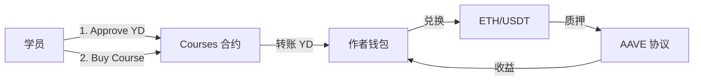
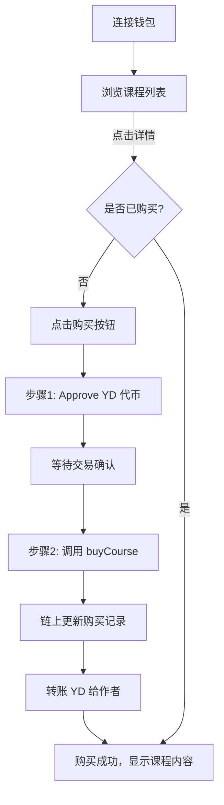
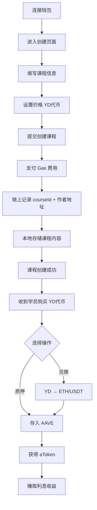
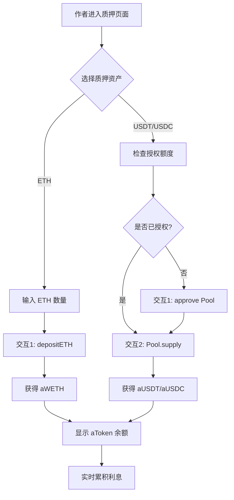

# Web3 大学 - 去中心化教育平台

> 基于区块链的在线课程购买与收益质押系统

## 📖 项目简介

Web3 大学是一个去中心化教育平台，通过智能合约实现：

- 🎓 **学员**：使用 YD 代币购买课程，链上验证授权
- ✍️ **作者**：创建课程并获得 YD 收益，支持兑换 ETH/USDT
- 💰 **DeFi 集成**：作者可将收益质押到 AAVE 获取利息

## 🏗️ 技术架构

### Monorepo 结构

```
web3-university/
├── web/              # Next.js 15 前端 (wagmi + viem)
├── contracts/        # Hardhat 智能合约 (YDToken, Courses, MockSwap)
└── shared/           # 共享类型与工具
```

### 核心技术栈

- **前端**: Next.js 15 + TypeScript + Tailwind CSS
- **Web3**: wagmi + viem + RainbowKit
- **合约**: Solidity + Hardhat + OpenZeppelin
- **DeFi**: Aave V3 协议集成
- **状态管理**: Tanstack Query

## 🚀 快速开始

### 1. 安装依赖

```bash
pnpm i
```

### 2. 启动本地区块链

```bash
# 终端 1
pnpm --filter @web3-university/contracts node
```

### 3. 部署合约并导出 ABI

```bash
# 终端 2
pnpm --filter @web3-university/contracts deploy && \
pnpm --filter @web3-university/contracts export-abi
```

### 4. 启动前端开发服务器

```bash
pnpm --filter web dev
```

访问 http://localhost:3000

## 📦 包管理命令

### 前端 (web/)

```bash
# 开发模式（使用 Turbopack）
pnpm --filter web dev

# 生产构建
pnpm --filter web build

# 代码检查
pnpm --filter web lint
```

### 合约 (contracts/)

```bash
# 编译合约
pnpm --filter @web3-university/contracts build

# 部署到本地网络
pnpm --filter @web3-university/contracts deploy

# 部署到 Sepolia 测试网
pnpm --filter @web3-university/contracts deploy:sepolia

# 导出 ABI 给前端
pnpm --filter @web3-university/contracts export-abi

# 同步合约到 web 包
pnpm --filter @web3-university/contracts sync-web
```

## 🔑 核心功能

### 学员端

#### 钱包连接
- ✅ 支持 MetaMask、WalletConnect 等主流钱包
- ✅ 显示 ENS 域名或地址缩略
- ✅ 实时同步钱包状态和余额

#### 课程浏览与购买
- ✅ **课程列表展示**
  - 从链上合约 `mapping(courseId => userOwned)` 查询购买状态
  - 课程基本信息（标题、简介、价格）存储在本地
  - 显示已购买标识和课程价格（YD 代币）

- ✅ **课程详情访问**
  - 已购买：返回完整课程内容
  - 未购买：显示课程预览和购买按钮

- ✅ **购买流程（两步交易）**
  - **步骤 1**: `approve()` - 授权合约使用指定数量的 YD 代币
  - **步骤 2**: `buyCourse(courseId)` - 扣除 YD 代币并更新链上购买记录
  - 实时显示交易状态和确认提示

#### 代币兑换
- ✅ ETH → YD 代币兑换（固定汇率 1 ETH = 4000 YD）
- ✅ 输入金额实时计算兑换结果
- ✅ 显示当前余额和兑换手续费

### 作者端

#### 课程管理
- ✅ **创建课程**
  - 输入课程标题、内容、价格（YD 代币单位）
  - 课程详情存储在本地（localStorage 或数据库）
  - 课程 ID 与作者地址记录在链上合约
  - 创建需支付 Gas 费用

- ✅ **收入管理**
  - 实时查看 YD 代币余额
  - 购买所得 YD 代币直接进入作者钱包
  - 支持将 YD 兑换为 ETH 或 USDT

#### DeFi 收益（AAVE 集成）
- ✅ **资产质押**
  - 支持 ETH 和 USDT 质押到 AAVE V3
  - ETH 路径：`WETHGateway.depositETH()` (1 次交互)
  - USDT 路径：`approve()` + `Pool.supply()` (2 次交互)

- ✅ **收益管理**
  - 获得 aToken（aWETH / aUSDT）凭证
  - 利息通过 aToken 实时累积，无需额外领取
  - 显示年化收益率和累计收益

- ✅ **代币兑换集成**
  - ETH → USDT 兑换（测试网支持）
  - 优先使用 Uniswap V3 进行真实兑换
  - 测试网可使用 USDC 替代 USDT

### 平台功能

- ✅ **链上映射**
  - `mapping(courseId => mapping(user => bool))` 记录购买关系
  - `mapping(courseId => author)` 记录课程归属

- ✅ **事件追踪**
  - `CourseCreated(courseId, author, price)` - 课程创建
  - `CoursePurchased(courseId, user, price)` - 课程购买

## 📝 智能合约

### 合约列表

| 合约        | 说明                                 | 主要方法 |
| ----------- | ------------------------------------ | -------- |
| YDToken.sol | ERC20 代币，用于课程购买和生态激励   | `mint`, `transfer`, `approve`, `transferFrom` |
| Courses.sol | 课程创建、购买、授权验证             | `createCourse`, `buyCourse`, `hasPurchased`, `setFee` |
| MockSwap.sol| 固定汇率兑换合约（教学用途）         | `ethToYD`, `ydToEth` |

### Courses.sol 核心接口

```solidity
// 创建课程（使用 bytes32 作为 ID）
function createCourse(
    bytes32 id,
    uint256 price,
    address author
) external

// 购买课程（需先 approve YDToken）
function buyCourse(bytes32 id) external

// 查询购买状态
function hasPurchased(
    bytes32 id,
    address user
) external view returns (bool)

// 设置平台手续费（仅 owner）
function setFee(address recipient, uint256 bps) external onlyOwner

// 事件
event CourseCreated(bytes32 indexed id, address indexed author, uint256 price);
event CoursePurchased(bytes32 indexed id, address indexed user, uint256 price, uint256 fee);
```

**重要实现细节**：
- Course ID 使用 `bytes32`（通过 `keccak256(stringToHex(id))` 计算）
- 支持平台手续费机制（`feeBps`，单位为基点，最高 10%）
- 作者创建课程后自动获得该课程访问权限
- 购买时同时转账给作者和平台手续费接收者

### MockSwap.sol 核心接口

```solidity
// ETH 兑换 YD（固定汇率 1:4000）
function ethToYD() external payable

// YD 兑换 ETH
function ydToEth(uint256 amount) external

uint256 public constant RATE = 4000; // YD per ETH
```

### AAVE 集成（测试网）

**支持的资产**：
- ETH（通过 WETHGateway）
- USDT / USDC（通过 Pool 合约）

**关键合约地址**（需在环境变量中配置）：
- `AAVE_POOL` - AAVE V3 Lending Pool
- `WETH_GATEWAY` - ETH 存取网关
- `SWAP_ROUTER` - Uniswap V3 路由（可选）

## 🌐 网络支持

- **本地开发**: Localhost (Chain ID: 31337)
- **测试网**: Sepolia (Chain ID: 11155111)
- **主网**: Ethereum Mainnet

## ⚙️ 环境变量

创建 `web/.env.local` 文件：

```bash
# 链 ID（默认 Sepolia）
NEXT_PUBLIC_CHAIN_ID=11155111

# RPC 端点（本地开发）
NEXT_PUBLIC_RPC_URL=http://127.0.0.1:8545

# WalletConnect 项目 ID
VITE_RP_WC_PROJECT_ID=your_project_id

# Sepolia RPC（可选）
VITE_RP_SEPOLIA_RPC_URL=https://sepolia.infura.io/v3/YOUR_KEY
```

## 📐 架构设计

### 数据存储模式

- **链上**：课程购买记录、代币转账、授权映射
- **链下**：课程内容、标题、简介（localStorage/数据库）

### 核心交互流程



### 用户完整流程

#### 学员购买课程



#### 作者创建课程与收益管理



#### AAVE 质押流程（三次交互）



## 🎯 开发注意事项

### 数据存储
- ✅ 课程元数据存储在 **Supabase** 数据库（`courses` 表）
- ✅ 链上仅存储购买记录（`mapping(bytes32 => mapping(address => bool))`）和课程价格
- ℹ️ Course ID 在前端使用字符串，在合约中使用 `keccak256(stringToHex(id))` 转换为 `bytes32`

### 交易流程
- ⚠️ "授权后购买"模式需要用户进行两次钱包签名
  - 第一次：`approve(Courses合约, 课程价格)`
  -第二次：`buyCourse(courseId)`
- ⚠️ 需在 UI 中明确提示用户交易步骤和当前进度

### 兑换机制
- ⚠️ MockSwap 使用固定汇率（1 ETH = 4000 YD），仅用于教学演示
- ⚠️ 生产环境需对接真实 DEX（Uniswap V3）或预言机获取市场价格
- ⚠️ 测试网 USDT 可能缺少流动性，建议使用 USDC 替代

### 安全性
- 🔒 Hardhat 配置包含示例助记词，**切勿在生产环境使用**
- 🔒 合约部署前需进行完整审计
- 🔒 AAVE 交互需验证合约地址真实性

### AAVE 集成
- ℹ️ aToken 利息自动累积，无需额外 claim 交易
- ℹ️ ETH 质押通过 WETHGateway 简化流程（1 次交互）
- ℹ️ ERC20 质押需先授权再存入（2 次交互）
- ℹ️ 测试网建议优先使用 Sepolia（AAVE 支持度好）

## 🛠️ 技术实现细节

### 前端目录结构

```
web/
├── app/                    # Next.js App Router 页面
│   ├── page.tsx           # 课程列表首页
│   ├── course/[id]/       # 课程详情（动态路由）
│   ├── author/new/        # 创建课程页面
│   ├── exchange/          # 代币兑换页面
│   ├── me/                # 个人中心（已购课程）
│   └── api/               # API 路由（可选）
├── components/
│   ├── wallet-connect.tsx # 钱包连接组件
│   ├── buy-button.tsx     # 购买按钮（含两步交易逻辑）
│   ├── swap-form.tsx      # 兑换表单
│   ├── stake-form.tsx     # 质押表单（AAVE 集成）
│   └── stake/             # 质押子组件
│       ├── AaveSection.tsx    # AAVE 存款区域
│       ├── SwapSection.tsx    # 兑换区域
│       └── TokenSelector.tsx  # 代币选择器
├── hooks/
│   ├── useAllowance.ts    # 查询授权额度
│   ├── useCourse.ts       # 课程数据管理
│   └── useAaveOperations.ts  # AAVE 操作 Hook
├── lib/
│   ├── wagmi.ts           # wagmi 配置（链、RPC、钱包）
│   ├── contracts.ts       # 合约 ABI 和地址导入
│   ├── storage.ts         # localStorage 封装
│   ├── courses.ts         # 课程业务逻辑
│   └── defi.ts            # DeFi 相关工具函数
└── contracts/             # 从合约包导出的 ABI
    ├── abis.json
    └── addresses.json
```

### 关键 Hooks 说明

#### `useAllowance`
```typescript
// 查询代币授权额度和状态
const {
  allowance,        // 当前授权额度
  canCheck,         // 是否可检查授权
  isApproved,       // 是否已授权足够额度
  needsApproval     // 是否需要授权
} = useAllowance({
  token,            // ERC20 代币地址
  owner,            // 持有者地址（默认当前账户）
  spender,          // 被授权地址（如 Courses 合约或 AAVE Pool）
  amount,           // 需要的额度
  enabled           // 是否启用查询
});
```

#### `useCourse`
```typescript
// 单个课程数据管理（从 Supabase 获取）
const {
  course,           // 课程数据
  isLoading,        // 加载状态
  error,            // 错误信息
  refetch           // 重新获取
} = useCourse(id);

// 查询链上购买状态
const {
  data: hasPurchased,  // 是否已购买
  isLoading
} = useOwnedCourse(id);
```

#### `useAaveOperations`
```typescript
// AAVE 质押操作（完整）
const {
  needsApproval,     // 是否需要授权
  isApproved,        // 是否已授权
  canDeposit,        // 是否可存款
  handleApprove,     // 执行授权
  handleDeposit,     // 执行存款
  approveTx,         // 授权交易状态
  supplyTx,          // 存款交易状态
  balances           // aToken 余额
} = useAaveOperations(
  address,           // 用户地址
  selectedToken,     // 选择的代币
  currentTokenAddress, // 代币合约地址
  tokenAmount,       // 存入数量
  pool               // AAVE Pool 地址
);
```

**其他实用 Hooks**：
- `useSwapOperations` - 处理 MockSwap 兑换逻辑
- `useTokenBalances` - 批量查询代币余额
- `useTxStatus` - 交易状态追踪
- `useCoursesList` - 课程列表管理

### 合约部署脚本

#### `scripts/deploy.ts`
部署核心合约并初始化参数：
- YDToken（初始铸造 100,000,000 YD 给 deployer）
- Courses（设置平台手续费为 500 bps = 5%）
- MockSwap（固定汇率 1 ETH = 4000 YD）
- 支持通过环境变量 `SEED_SWAP_YD` 为 MockSwap 预铸造 YD 代币

#### `scripts/export-abi.ts`
导出合约 ABI 和地址到 `contracts/exports/<chainId>.json` 供前端使用

#### `scripts/sync-web.ts`
同步合约数据到 web 包的 `contracts/` 目录，确保前端使用最新合约

### 状态管理

- **钱包状态**: wagmi 自动管理（连接、地址、余额、链）
- **课程数据**: Supabase + React 自定义 Hook（`useCourse`, `useCoursesList`）
- **链上数据**: wagmi `useReadContract` 查询（购买状态、授权额度等）
- **交易状态**: 自定义 `useTxStatus` Hook 封装 wagmi 的交易追踪逻辑

### AAVE 测试网配置

**Sepolia 测试网地址示例**：
```typescript
{
  AAVE_POOL: "0x6Ae43d3271ff6888e7Fc43Fd7321a503ff738951",
  WETH_GATEWAY: "0x387d311e47e80b498169e6fb51d3193167d89F7D",
  WETH: "0xC558DBdd856501FCd9aaF1E62eae57A9F0629a3c",
  // 具体地址以 AAVE 官方文档为准
}
```

## 📚 相关文档

- [详细需求文档](./task.md) - 完整产品需求和技术方案
- [开发指南](./CLAUDE.md) - Claude Code 工作指南
- [Next.js 文档](https://nextjs.org/docs) - 前端框架
- [wagmi 文档](https://wagmi.sh) - Web3 React Hooks
- [Hardhat 文档](https://hardhat.org) - 智能合约开发
- [AAVE V3 文档](https://docs.aave.com/developers/core-contracts/pool) - DeFi 协议集成

## 🚧 后续规划

- [ ] 迁移课程数据到 Supabase/PostgreSQL
- [ ] 集成真实 DEX 价格（Uniswap V3）
- [ ] 添加课程评价和评分系统
- [ ] 支持课程 NFT 凭证
- [ ] 实现平台手续费机制（2%-5%）
- [ ] The Graph 子图集成（链上数据索引）
- [ ] 多语言支持（i18n）

## 🤝 贡献

欢迎提交 Issue 和 Pull Request！

### 贡献指南
1. Fork 本仓库
2. 创建功能分支 (`git checkout -b feature/AmazingFeature`)
3. 提交更改 (`git commit -m 'Add some AmazingFeature'`)
4. 推送到分支 (`git push origin feature/AmazingFeature`)
5. 开启 Pull Request

## 📄 许可证

MIT License

---

**Built with ❤️ for Web3 Education**
