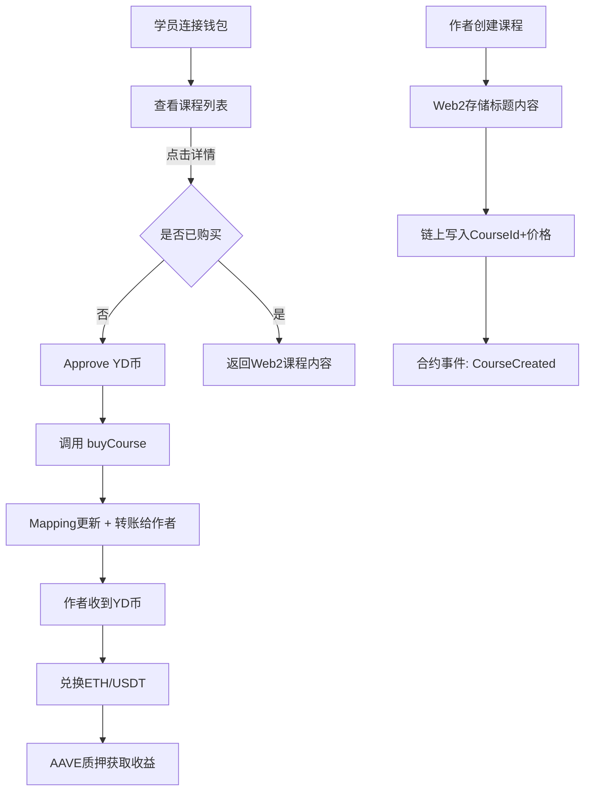

## 1. 产品背景

Web3大学旨在通过 **链上课程购买系统** 实现教育内容的去中心化支付与授权。用户可使用平台代币（YD币）购买课程，课程作者则通过YD币兑换ETH/USDT，并支持AAVE质押获取收益。

---

## 2. 功能需求

### 2.1 用户端（课程学员）

* **钱包连接**

  * 支持MetaMask或其他Web3钱包，显示ENS/地址。
* **课程列表展示**

  * 从链上合约 `mapping(courseId => userOwned)` 获取用户是否已购买。
  * 课程基本信息（标题、简介、价格）存储在Web2数据库。
* **课程详情**

  * 点击课程详情时，后端通过钱包地址校验是否购买过对应课程（链上查询）。
  * 已购买 → 返回Web2存储的课程内容。
  * 未购买 → 提示无权限。
* **课程购买**

  * 步骤1：approve （授权合约使用用户指定数量的YD币）。
  * 步骤2：调用合约 `buyCourse(courseId)` 扣除YD币，转账给课程作者，并更新链上 `mapping`。
* **代币兑换**

  * 提供 ETH ↔ YD 币兑换功能（例如 1 ETH = 4000 YD）。
  * 界面有输入兑换数量和确认兑换按钮。

---

### 2.2 作者端（课程作者）

* **课程创建**

  * 输入课程标题、内容、价格（单位：YD币）。
  * 课程详情存储在Web2（数据库/localStorage）。
  * 课程ID与作者地址存储在链上合约（mapping）。
  * 创建课程需支付Gas。
* **收入管理**

  * 购买课程所得的YD币会进入作者钱包。
  * 作者可将YD币兑换成ETH或USDT。
* **选修功能：AAVE质押**

  * 作者可将ETH/USDT存入AAVE合约。
  * 三次钱包交互（approve → supply → aToken到账）。
  * 获得利息收益（如年化5%）。

---

### 2.3 管理与平台逻辑

* 平台可在交易中收取手续费（如2%-5%）。
* 平台通过合约控制资金流转：

  * 学员 → 合约（approve + transfer） → 作者钱包。
* 映射关系：

  * `mapping(courseId => mapping(user => bool))` 记录用户是否购买。

---

## 3. 技术方案

### 3.1 前端

* **框架**: next.js
* **钱包连接**:

  * wagmi + viem （更现代）
  * 或 ethers.js（更轻量）
* **UI**: TailwindCSS + shadcn/ui

### 3.2 后端

* **Web2部分存储课程信息**

  * 存储在localStorage即可。

### 3.3 合约（Solidity）

* **代币合约**: ERC20 (YD Token)
* **课程合约**:

  * `createCourse(courseId, price, author)`
  * `buyCourse(courseId)`
  * `mapping(courseId => mapping(user => bool))` 购买记录
  * `event CourseCreated(courseId, author, price)`
  * `event CoursePurchased(courseId, user, price)`
* **兑换合约（可简化为Mock Swap）**

  * 实现 ETH ↔ YD 币兑换
* **AAVE交互**

  * 调用 AAVE V3 lending pool 合约（`supply()` 方法）
  * 资产获得 aToken (aETHUSDT)。

### 3.4 The Graph（可选）

* 用于链上课程购买事件的索引，前端可快速查询用户已购买课程列表。

---

## 4. 用户流程



---

## 5. 技术栈总结

* **智能合约**: Solidity + Hardhat
* **代币标准**: ERC20 (hewei币)
* **链上交互**: wagmi/viem 或 ethers.js 
* **前端**: Next.js , 需要使用next.js 的cli 来初始化项目，使用pnpm来进行包管理
* **DeFi对接**: AAVE V3 合约

---

## 6. 项目结构如下：


```
web3-university/
├─ package.json                # pnpm workspace 根配置
├─ pnpm-workspace.yaml
├─ README.md
├─ .gitignore
│
├─ web/                        # 前端 Next.js 应用
│  ├─ app/
│  │  ├─ page.tsx             # 课程列表
│  │  ├─ course/[id]/page.tsx # 课程详情
│  │  ├─ author/new/page.tsx  # 创建课程
│  │  ├─ exchange/page.tsx    # ETH ↔ YD 兑换
│  │  └─ layout.tsx
│  ├─ components/
│  │  ├─ wallet-connect.tsx
│  │  ├─ course-card.tsx
│  │  ├─ buy-button.tsx
│  │  └─ swap-form.tsx
│  ├─ lib/
│  │  ├─ wagmi.ts             # wagmi/viem 配置
│  │  ├─ contracts.ts         # 合约地址/ABI 读取（来自 contracts/exports）
│  │  └─ storage.ts           # localStorage 读写封装
│  ├─ data/
│  │  └─ courses.seed.json    # 课程元数据种子
│  ├─ types/                  # 前端局部类型（或从 shared 引用）
│  ├─ public/
│  ├─ next.config.ts
│  ├─ tsconfig.json
│  ├─ .env.local.example      # NEXT_PUBLIC_CHAIN_ID / RPC / 合约地址
│  └─ package.json
│
├─ contracts/                  # Hardhat 合约与部署
│  ├─ contracts/
│  │  ├─ YDToken.sol          # ERC20(YD)
│  │  ├─ Courses.sol          # 课程创建/购买/手续费
│  │  └─ MockSwap.sol         # 固定汇率 ETH ↔ YD
│  ├─ scripts/
│  │  ├─ deploy.ts            # 部署合约并初始化
│  │  └─ export-abi.ts        # 导出 ABI+地址 到 exports/
│  ├─ exports/
│  │  └─ <chainId>.json       # { addresses, abis } 供 web 引用
│  ├─ hardhat.config.ts
│  ├─ package.json
│  └─ test/
│
├─ shared/                     # 前后端共用类型/常量/工具
│  ├─ src/
│  │  ├─ types/course.ts
│  │  ├─ constants/fees.ts    # 平台手续费 bps
│  │  └─ utils/pricing.ts     # 汇率与格式化
│  └─ package.json
│
└─ subgraph/                   # 可选：The Graph 子图
   ├─ schema.graphql
   ├─ subgraph.yaml
   ├─ src/mapping.ts
   └─ package.json

```
