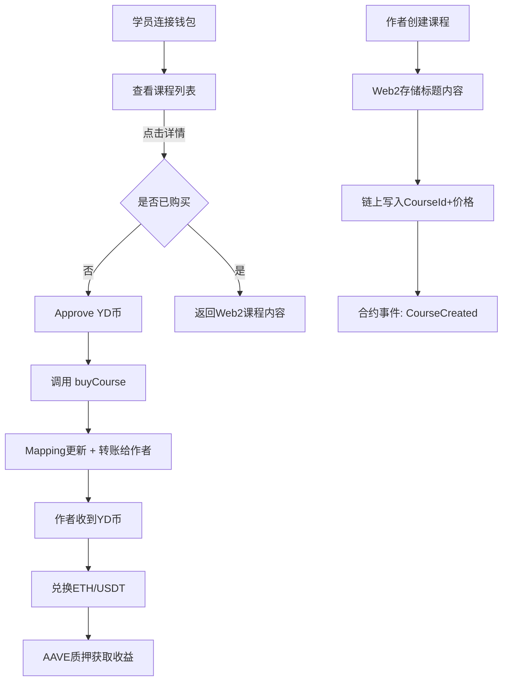

## 1. 产品背景

Web3 大学旨在通过 **链上课程购买系统** 实现教育内容的去中心化支付与授权。用户可使用平台代币（YD 币）购买课程，课程作者则通过 YD 币兑换 ETH/USDT，并支持 AAVE 质押获取收益。

---

## 2. 功能需求

### 2.1 用户端（课程学员）

- **钱包连接**

  - 支持 MetaMask 或其他 Web3 钱包，显示 ENS/地址。

- **课程列表展示**

  - 从链上合约 `mapping(courseId => userOwned)` 获取用户是否已购买。
  - 课程基本信息（标题、简介、价格）存储在 Web2 数据库。

- **课程详情**

  - 点击课程详情时，后端通过钱包地址校验是否购买过对应课程（链上查询）。
  - 已购买 → 返回 Web2 存储的课程内容。
  - 未购买 → 提示无权限。

- **课程购买**

  - 步骤 1：approve （授权合约使用用户指定数量的 YD 币）。
  - 步骤 2：调用合约 `buyCourse(courseId)` 扣除 YD 币，转账给课程作者，并更新链上 `mapping`。

- **代币兑换**

  - 提供 ETH ↔ YD 币兑换功能（例如 1 ETH = 4000 YD）。
  - 界面有输入兑换数量和确认兑换按钮。

---

### 2.2 作者端（课程作者）

- **课程创建**

  - 输入课程标题、内容、价格（单位：YD 币）。
  - 课程详情存储在 Web2（数据库/localStorage）。
  - 课程 ID 与作者地址存储在链上合约（mapping）。
  - 创建课程需支付 Gas。

- **收入管理**

  - 购买课程所得的 YD 币会进入作者钱包。
  - 作者可将 YD 币兑换成 ETH 或 USDT。
  -

- **选修功能：AAVE 质押**
  - 作者可将 ETH/USDT 存入 AAVE 合约。
  - 三次钱包交互
    - 第一次和合约交互 交 gas
    - 第二次合约确认成功
    - 第三次合约 钱包会再弹一次，合约给用户赚钱 aethusdt
  - 获得利息收益（如年化 5%）。

---

### 2.3 管理与平台逻辑

- 平台可在交易中收取手续费（如 2%-5%）。
- 平台通过合约控制资金流转：

  - 学员 → 合约（approve + transfer） → 作者钱包。

- 映射关系：

  - `mapping(courseId => mapping(user => bool))` 记录用户是否购买。

---

## 3. 技术方案

### 3.1 前端

- **框架**: next.js
- **钱包连接**:

  - wagmi + viem （更现代）
  - 或 ethers.js（更轻量）

- **UI**: TailwindCSS + shadcn/ui

### 3.2 后端

- **Web2 部分存储课程信息**

  - 存储在数据库中

### 3.3 合约（Solidity）

- **代币合约**: ERC20 (YD Token)
- **课程合约**:

  - `createCourse(courseId, price, author)`
  - `buyCourse(courseId)`
  - `mapping(courseId => mapping(user => bool))` 购买记录
  - `event CourseCreated(courseId, author, price)`
  - `event CoursePurchased(courseId, user, price)`

- **兑换合约（可简化为 Mock Swap）**

  - 实现 ETH ↔ YD 币兑换

- **AAVE 交互**

  - 调用 AAVE V3 lending pool 合约（`supply()` 方法）
  - 资产获得 aToken (aETHUSDT)。

### 3.4 The Graph（可选）

- 用于链上课程购买事件的索引，前端可快速查询用户已购买课程列表。

---

## 4. 用户流程



## 5. 技术栈总结

- **智能合约**: Solidity + Hardhat
- **代币标准**: ERC20 (YD 币)
- **链上交互**: wagmi/viem 或 ethers.js
- **前端**: Next.js , 需要使用 next.js 的 cli 来初始化项目，使用 pnpm 来进行包管理
- **DeFi 对接**: AAVE V3 合约

---

## 6. 项目结构如下：

```
web3-university/
├─ package.json                # pnpm workspace 根配置
├─ pnpm-workspace.yaml
├─ README.md
├─ .gitignore
│
├─ web/                        # 前端 Next.js 应用
│  ├─ app/
│  │  ├─ page.tsx             # 课程列表
│  │  ├─ course/[id]/page.tsx # 课程详情
│  │  ├─ author/new/page.tsx  # 创建课程
│  │  ├─ exchange/page.tsx    # ETH ↔ YD 兑换
│  │  └─ layout.tsx
│  ├─ components/
│  │  ├─ wallet-connect.tsx
│  │  ├─ course-card.tsx
│  │  ├─ buy-button.tsx
│  │  └─ swap-form.tsx
│  ├─ lib/
│  │  ├─ wagmi.ts             # wagmi/viem 配置
│  │  ├─ contracts.ts         # 合约地址/ABI 读取（来自 contracts/exports）
│  │  └─ storage.ts           # localStorage 读写封装
│  ├─ data/
│  │  └─ courses.seed.json    # 课程元数据种子
│  ├─ types/                  # 前端局部类型（或从 shared 引用）
│  ├─ public/
│  ├─ next.config.ts
│  ├─ tsconfig.json
│  ├─ .env.local.example      # NEXT_PUBLIC_CHAIN_ID / RPC / 合约地址
│  └─ package.json
│
├─ contracts/                  # Hardhat 合约与部署
│  ├─ contracts/
│  │  ├─ YDToken.sol          # ERC20(YD)
│  │  ├─ Courses.sol          # 课程创建/购买/手续费
│  │  └─ MockSwap.sol         # 固定汇率 ETH ↔ YD
│  ├─ scripts/
│  │  ├─ deploy.ts            # 部署合约并初始化
│  │  └─ export-abi.ts        # 导出 ABI+地址 到 exports/
│  ├─ exports/
│  │  └─ <chainId>.json       # { addresses, abis } 供 web 引用
│  ├─ hardhat.config.ts
│  ├─ package.json
│  └─ test/
│
├─ shared/                     # 前后端共用类型/常量/工具
│  ├─ src/
│  │  ├─ types/course.ts
│  │  ├─ constants/fees.ts    # 平台手续费 bps
│  │  └─ utils/pricing.ts     # 汇率与格式化
│  └─ package.json
│
└─ subgraph/                   # 可选：The Graph 子图
   ├─ schema.graphql
   ├─ subgraph.yaml
   ├─ src/mapping.ts
   └─ package.json

## 7. AAVE 质押 MVP（简化方案）

目标：先实现“ETH 兑换 USDT，再质押到 AAVE”，仅在测试网落地；在不改动核心课程/兑换功能的前提下，快速交付最小可用版本。

### 7.1 范围与顺序（更简单）

- 步骤 1：ETH → USDT 兑换（测试网）
  - 优先使用测试网 Uniswap v3 路由完成真实兑换。
  - 如目标测试网缺少 USDT 流动性，则退而求其次使用 USDC（与 AAVE 测试网支持度更好）。
  - 若仍不可行，临时提供 MockUSDT + MockSwap 仅用于演示兑换 UI（不参与 AAVE 存入）。
- 步骤 2：将资产存入 AAVE（测试网）
  - ETH：通过 WETHGateway `depositETH()` 存入（1 次钱包交互）。
  - USDT：先 `approve(Pool)`，再 `Pool.supply()`（2 次钱包交互）。
  - 三次钱包交互符合预期：① 兑换（swap）② 授权（approve）③ 存入（supply）。

### 7.2 仅测试网（不部署主网）

- 默认网络：Sepolia（可根据团队 RPC 与资产支持度调整）。
- 需要在 `.env.local` 或 `contracts/exports/<chainId>.json` 中配置下列地址：
  - AAVE：`AAVE_POOL`、`WETH_GATEWAY`、`WETH`、`aWETH`、（可选）`USDT`、`aUSDT`
  - Uniswap：`SWAP_ROUTER`（若采用真实兑换）

### 7.3 合约与导出（保持最少）

- 不新增业务合约（首期直接与 AAVE/Uniswap 合约交互）。
- 若回退到 Mock 方案：
  - 新增 `MockUSDT.sol`（6 位小数）与 `MockSwapUSDT.sol`（固定汇率）
  - 仅供演示兑换 UI，AAVE 存入仍以 ETH 路径为主。
- `contracts/exports/<chainId>.json` 增加上述第三方合约地址，供前端引用。

### 7.4 前端与交互

- 新增页面：`/author/stake`
- 两块区域：
  - 兑换区：ETH → USDT（或 USDC），展示余额、价格、最小可得，按钮一键兑换。
  - 质押区：
    - 资产切换：ETH / USDT（默认 ETH 可用，USDT 视可用性打开）
    - ETH：输入金额 → 调用 `WETHGateway.depositETH()`
    - USDT：检测 `allowance`，不足则先 `approve`，再 `Pool.supply()`
    - UI 状态分三步：兑换 → 授权 → 存入；aToken 到账在“存入”确认中提示（无需额外签名）

### 7.5 实施步骤（MVP）

1) 配置测试网地址（AAVE 与 Uniswap），更新 `contracts/exports` 与 `web/.env.local.example`
2) 前端 `/author/stake` 搭建最小 UI（复用 wagmi、useTxStatus）
3) 打通 ETH 存入 AAVE 路径（WETHGateway），完成成功/异常提示
4) 兑币对接：优先对接 Uniswap v3（若不稳定则临时 Mock）
5) 补充 USDT 存入路径（approve + supply），若测试网无 USDT 支持，则改用 USDC

### 7.6 验收标准

- 在测试网完成以下闭环：
  - ① ETH → USDT（或 USDC）兑换成功
  - ② ETH 存入 AAVE 成功（aWETH 余额增加）
  - ③ USDT（或 USDC）存入 AAVE 成功（aToken 余额增加）
  - ④ 全流程三次钱包交互：Swap → Approve → Supply
- 课程购买与 YD 兑换功能不受影响

### 7.7 备注与简化点

- AAVE 的利息通过 aToken 实时累积，无需额外“领取”交易
- 若 USDT 在所选测试网缺少官方支持或流动性，优先改用 USDC，命名上在 UI 标注“测试网使用 USDC 代替”
- 后续可根据需要再引入 Adapter 合约以支持平台抽成或额度管理
